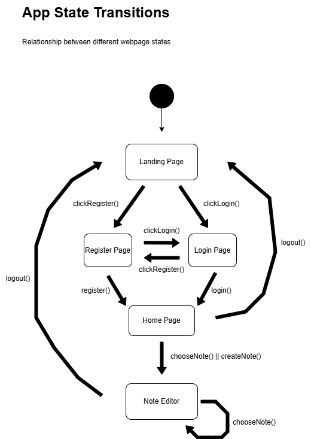

# NotNotion

A user-friendly note-taking app made for UCLA's CS35L class.

Accessible over web browser, utilizing a markdown-based note-taking mechanism that allows for various typesetting options, picture insertion, and the organization of user pages for future access and synced to a database for safekeeping.

## Build Instructions

Follow these steps to clone the repository and run the application locally.

### Prerequisites

You must have the following installed on your computer:

- **Node.js** (v14 or higher) - Installation script can be found [here](https://nodejs.org/en/download)
- **MongoDB** - Installation guide can be found [here](https://www.mongodb.com/docs/manual/installation/)
- **Git** - For cloning the repository

### Local Setup

1. **Clone the Repository**
   Clone NotNotion to local machine:

   ```bash
   git clone https://github.com/Dabbuka/NotNotion
   ```

   Your local machine should now have the most up-to-date version of NotNotion.

2. **Install Frontend Dependencies:**
   Navigate into the project directory after cloning the repo and install all Node packages required for the frontend:

   ```bash
   cd NotNotion/frontend
   npm install
   ```
   This step downloads all packages listed in `package.json`

3. **Run the Application:**
   While still in the `/NotNotion/frontend` directory, start the development server:

   ```bash
   npm run dev
   ```


  You should see a message like:
  ```
  > frontend@0.0.0 dev
  > vite


    VITE v7.1.12  ready in 208 ms

    ➜  Local:   http://localhost:5173/
    ➜  Network: use --host to expose
    ➜  press h + enter to show help
  ```
  The frontend is now running locally at http://localhost:5173/

  ## Folder Structure/
  - **frontend/**
    - **src/**
      - **assets** - holds all of the png images used for the main README for the documentation
      - **pages** - holds all of the jsx and css files, so all of the visual components of the app
      - `App.jsx` - main app file that references all of the pages.
      - `index.css`-  this is the global CSS file for NotNotion, setting the app-wide styles.
      - `main.jsx` -  this is what our package.json references to (after looking inside index.html) when we run npm run dev
  
    - **test-results** - holds the json file of the passed and failed test cases
      - `.last-run.json` - the described json file above
    - **tests** - holds the playwright tests
      - `auth.spec.ts` - tests the authentication of creating new users
      - `create-note.spec.ts` - tests the ability to create new notes from the perspective of a new user wanting to use the app
  
    - `.env` –  environment variables, IGNORED BY GIT
    - `package.json` – Node.js project file
    - `README.md` – This file
  

4. **Install Backend Dependencies:**
   Navigate into project directory and install packages required for the backend:

   ```bash
   cd NotNotion/backend
   npm install
   ```

   This step downloads all packages required for the backend.

5. **Start backend Server:**
   Create a `.env` file in the `/NotNotion/backend` directory with your MongoDB connection string:
   ```
   MONGODB_URI=your_mongodb_connection_string
   PORT=3000
   ```
   While still in the `/NotNotion/backend` directory, start the backend server:
   ```bash
   npm start
   ```

  ## API Routes

  | Route                              | Method | Description                                    |
  |-----------------------------------|--------|------------------------------------------------|
  | **Notes**                         |        |                                                |
  | /api/notes/createNote             | POST   | Create a new note                              |
  | /api/notes/all                    | GET    | Get all notes for a user (requires userID query param) |
  | /api/notes/:id                    | GET    | Get a single note by ID                        |
  | /api/notes/:id                    | PATCH  | Update a note by ID                            |
  | /api/notes/user/:userId           | GET    | Get the most recent note for a user            |
  | /api/notes/user/:userId/:title    | GET    | Get a note by user ID and title                |
  | **Users**                         |        |                                                |
  | /api/users/register               | POST   | Register a new user                            |
  | /api/users/login                  | POST   | Log in a user (returns JWT token)             |
  | /api/users/me                     | GET    | Retrieve current user information              |
  | **Folders**                       |        |                                                |
  | /api/folders/createFolder         | POST   | Create a new folder                            |
  | /api/folders/:id                  | GET    | Get a folder by ID                             |
  | /api/folders/renameFolder         | PATCH  | Rename a folder                                |
  | /api/folders/addFolder            | POST   | Add a folder                                   |


## Features:

- **User Authentication** - Register and login with JWT tokens
- **Note Creation** - Create, read, update, and delete notes
- **Rich Text Editing** - Markdown-based editor with TipTap
- **Picture Insertion** - Drag and drop or paste images into notes
- **Typography Options** - Headings, bold, italic, strikethrough
- **Lists** - Bulleted and numbered lists
- **Search & Sort** - Search notes and sort by name, date, or last modified

## Testing

The project uses Playwright for end-to-end testing. To run tests:

```bash
cd frontend
npx playwright test
```

To run a specific test file:

```bash
npx playwright test auth.spec.ts
npx playwright test create-note.spec.ts
```

To run tests in headed mode (see the browser):

```bash
npx playwright test --headed
```

To run tests with UI mode:

```bash
npx playwright test --ui
```

**Note:** Make sure both the backend and frontend servers are running before executing tests.

## Diagrams

### Application State Diagram

This diagram illustrates the client-side state transitions and navigation flow throughout the NotNotion application. It shows how users move between different pages and the actions that trigger these transitions:



**Initial entry** starts from the Landing Page (entry point of the application), which transitions to
**authentication flow** between Register and Login pages, allowing users to switch between registration and login. The
**main application flow** occurs from Home Page to Note Editor, where users can create or select notes.
**Logout transitions** return authenticated users to the Landing Page from the Note Editor or Home Page.
**Self-loops** in the Note Editor indicate switching between notes without returning to the Home Page.

### Application Sequence Diagram

This diagram illustrates the full client-server interaction flow for user registration and note creation in NotNotion. It shows how data flows between four participants: the User, Frontend, Express.js Server, and MongoDB Database:


**User Registration Flow (Steps 1-7):**

1. User clicks "Get Started" and is routed to the `/register` page
2. User fills out registration fields and clicks "Register"
3. Frontend sends POST request to `/api/users/register` with username, email, and password
4. Backend processes the request with multiple possible responses (Alt block):
   - `400` - User didn't fill out all fields
   - `400` - User already exists
   - `400` - Invalid user data
   - `500` - Server error (database failure)
   - `201` - User successfully created (with JWT token)
5. On success, MongoDB inserts the new user record
6. Frontend routes user to `/home` page

**Note Creation Flow (Steps 8-13):**

1. User clicks "+ New Document" and fills out the title field
2. User clicks "Create" button
3. Frontend sends POST request to `/api/notes/createNote` with title, content, and userID
4. Backend processes the request with multiple possible responses (Alt block):
   - `400` - User didn't fill out title field
   - `400` - UserID not found
   - `500` - Server error (database failure)
   - `201` - Note successfully created (returns savedNote)
5. On success, MongoDB inserts the new note record
6. Frontend routes user to `/app?noteId=[noteID]` to open the Note Editor
